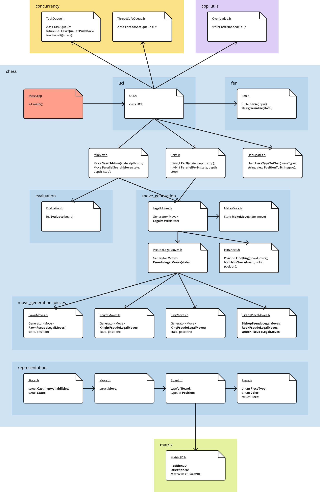

# chss

## About The Project

Simple chess engine. It is a personal project to learn more about chess programming. So far it has been a really fun experience.

It is written in C++20, and implements the UCI protocol to communicate with GUIs.

## Principles

* Simplicity and clarity: Simple code and a clear split in functions, files, and namespaces.
* High test coverage.
* Modern and safe C++ usage, enforced by making as much code `constexpr` as possible.
* No allocations during the search tree exploration. Moves are generated in a lazy manner.
* Minimal dependencies (only Google Test for unit tests).

## Code organization



## TODO

The program is in a very early stage. Tasks that I would like to do soon, in no particular order:
- [ ] Unit tests for ThreadSafeQueue.
- [ ] More unit tests for Search (MinMax).
- [ ] Unit tests for UCI.
- [ ] Unify the unit tests: either use Google Test or my little test_utils framework.
- [ ] Implement sale mate.
- [ ] Implement the 50-move rule.
- [ ] Implement the repetition rule.
- [ ] The main thread should not have a busy loop. Instead, it should wait for a condition variable that notifies that either there is input to consume of a computation has finished.
- [ ] Maybe the UCI should talk to the engine through an interface (clear contract).
- [ ] Smarter/cleaner parallelization of the work. I feel the UCI/Search/Perft could dispatch their tasks in a more elegant manner.
- [ ] Extend the UCI protocol to support `go movetime`.
- [ ] Fully implement the UCI protocol.
- [ ] Alpha-beta pruning.
- [ ] Reordering of generated moves.
- [ ] Memoization of searches (Transposition tables, hashing of moves (zobrist), etc.).
- [ ] More sophisticated evaluation function (currently only takes into account piece value and centrality).
- [ ] Bitboards.
- [ ] Optimize finding the king (to make the IsInCheck function faster).
- [ ] Make sure it works in different GUIs (there are problems in En-Croissant).
- [ ] Create a Peft acceptance-test that runs the program against a list of positions (`go perft D`).
- [ ] Explore replacing the evaluate function with some kind of neural network (NNUE) from another engine.
- [ ] Explore different kinds of neural network architectures to evaluate positions and train them.
- [ ] etc.

## Using it

### Build
You need a C++20 compiler and CMake 3.26 or later.

To compile:
```
mkdir build
cd build
cmake ..
make
```

The executable file will be the `./build/chess/chess`.

### Use it from a GUI

It currently works with Cute Chess. I recommend using the following Time Control Mode: Infinite, Plies: 5.

It does not work in En-Croissant at the moment.
